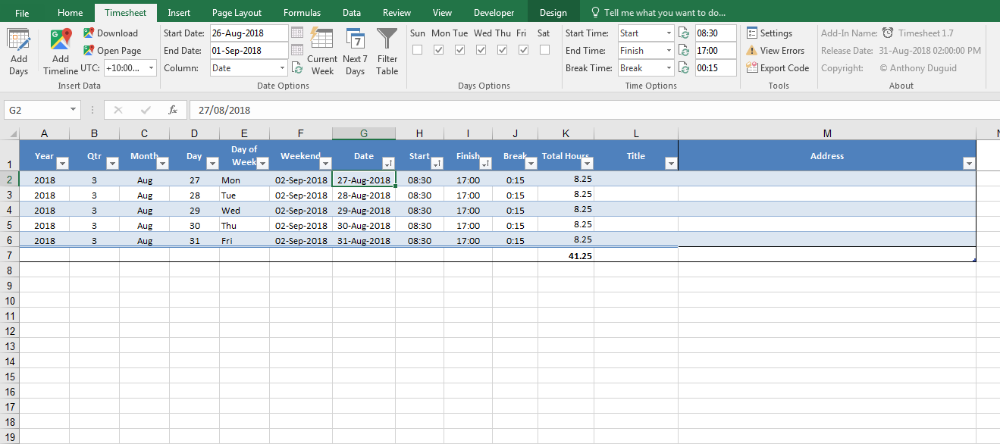

This Add-In is used to produce a timesheet file with functionality to import your Google Timeline. 

[](https://paypal.me/AnthonyDuguid)
[](LICENSE "MIT License Copyright © Anthony Duguid")
[](https://github.com/Office-projects/Excel-Timesheet/releases)
[](https://github.com/Office-projects/Excel-Timesheet)

TODO: convert to .NET project and write up details of controls
* Tested on Windows 7 / Excel 2016

The most complete version is VBA. 
<a href="https://github.com/Office-projects/Excel-Timesheet/issues" target="_blank">
 
</a>

<h1 align="left">
  
</h1>

<br>

## Table of Contents
- <a href="#install">Install</a>
- <a href="#dependencies">Dependencies</a>
- <a href="#glossary-of-terms">Glossary of Terms</a>
- <a href="#functionality">Functionality</a> 
    - <a href="#buttons">Buttons</a>
    - <a href="#help">Help</a>
    - <a href="#about">About</a>

<br>

<a id="user-content-install" class="anchor" href="#install" aria-hidden="true"> </a>
## Install
Instructions for installation of VBA version

### VBA
How to install the VBA version
1. Download the VBA Add-In file [](https://github.com/Office-projects/Excel-Timesheet/raw/master/VBA/Timesheet.xlsm?raw=true "Download the VBA Add-In").

<br>

<a id="user-content-dependencies" class="anchor" href="#dependencies" aria-hidden="true"> </a>
## Dependencies
|Software                                   |Dependency                 |Project                    |
|:------------------------------------------|:--------------------------|:--------------------------|
|[Microsoft Visual Studio Community 2017](https://www.visualstudio.com/vs/whatsnew/)|Solution|VSTO|
|[Microsoft Office Developer Tools](https://visualstudio.microsoft.com/vs/features/office-tools/)|Solution|VSTO|
|[Microsoft Excel 2010 (or later)](https://www.microsoft.com/en-au/software-download/office)|Project|VBA, VSTO|
|[Visual Basic for Applications](https://msdn.microsoft.com/en-us/vba/vba-language-reference)|Code|VBA|
|[Extensible Markup Language (XML)](https://www.rondebruin.nl/win/s2/win001.htm)|Ribbon|VBA, VSTO|
|[Log4Net](https://www.nuget.org/packages/log4net/) |Error Logging |VSTO|
|[ScreenToGif](http://www.screentogif.com/)|Read Me|VBA, VSTO|
|[Snagit](http://discover.techsmith.com/snagit-non-brand-desktop/?gclid=CNzQiOTO09UCFVoFKgod9EIB3g)|Read Me|VBA, VSTO|
|Badges ([Library](https://shields.io/), [Custom](https://rozaxe.github.io/factory/), [Star/Fork](http://githubbadges.com))|Read Me|VBA, VSTO|

<br>

<a id="user-content-glossary-of-terms" class="anchor" href="#glossary-of-terms" aria-hidden="true"> </a>
## Glossary of Terms

| Term                      | Meaning                                                                                  |
|:--------------------------|:-----------------------------------------------------------------------------------------|
| COM |Component Object Model (COM) is a binary-interface standard for software components introduced by Microsoft in 1993. It is used to enable inter-process communication and dynamic object creation in a large range of programming languages. COM is the basis for several other Microsoft technologies and frameworks, including OLE, OLE Automation, ActiveX, COM+, DCOM, the Windows shell, DirectX, UMDF and Windows Runtime.  |
| VBA |Visual Basic for Applications (VBA) is an implementation of Microsoft's event-driven programming language Visual Basic 6 and uses the Visual Basic Runtime Library. However, VBA code normally can only run within a host application, rather than as a standalone program. VBA can, however, control one application from another using OLE Automation. VBA can use, but not create, ActiveX/COM DLLs, and later versions add support for class modules.|
| VSTO |Visual Studio Tools for Office (VSTO) is a set of development tools available in the form of a Visual Studio add-in (project templates) and a runtime that allows Microsoft Office 2003 and later versions of Office applications to host the .NET Framework Common Language Runtime (CLR) to expose their functionality via .NET.|
| XML|Extensible Markup Language (XML) is a markup language that defines a set of rules for encoding documents in a format that is both human-readable and machine-readable.The design goals of XML emphasize simplicity, generality, and usability across the Internet. It is a textual data format with strong support via Unicode for different human languages. Although the design of XML focuses on documents, the language is widely used for the representation of arbitrary data structures such as those used in web services.|
| KML|Keyhole Markup Language (KML) is an XML notation for expressing geographic annotation and visualization within Internet-based, two-dimensional maps and three-dimensional Earth browsers. KML was developed for use with Google Earth, which was originally named Keyhole Earth Viewer.|
<body>

<br>

<a id="user-content-functionality" class="anchor" href="#functionality" aria-hidden="true"> </a>
## Functionality
This Excel ribbon is inserted after the “Home” tab when Excel opens. Listed below is the detailed functionality of this application and its components.  


<a id="user-content-format-data-table" class="anchor" href="#format-data-table" aria-hidden="true"> </a>
### Insert Data (Group)


<a id="user-content-format-as-table" class="anchor" href="#format-as-table" aria-hidden="true"> </a>
####	Add Days (Button)
* ...

<a id="user-content-freeze-panes" class="anchor" href="#freeze-panes" aria-hidden="true"> </a>
####	Add Timeline (Button)
* ...

<a id="user-content-remove-duplicates" class="anchor" href="#remove-duplicates" aria-hidden="true"> </a>
#### Download (Button)
* ...

<a id="user-content-separate-values" class="anchor" href="#separate-values" aria-hidden="true"> </a>
#### Open Page (Button)
* ...

<a id="user-content-clean-data" class="anchor" href="#clean-data" aria-hidden="true"> </a>
#### UTC (Dropdown)
* ...

<a id="user-content-format-data-table" class="anchor" href="#format-data-table" aria-hidden="true"> </a>
### Date Options (Group)


<a id="user-content-format-data-table" class="anchor" href="#format-data-table" aria-hidden="true"> </a>
### Days Options (Group)


<a id="user-content-format-data-table" class="anchor" href="#format-data-table" aria-hidden="true"> </a>
### Time Options (Group)


<a id="user-content-help" class="anchor" href="#help" aria-hidden="true"> </a>
###	Tools (Group)

<a id="user-content-settings" class="anchor" href="#settings" aria-hidden="true"> </a>
#### Settings (Button)

<kbd>
VSTO
<br>
  
</kbd>

- Types of VSTO Settings
  - Application Settings
    - These settings can only be changed in the project and need to be redeployed
    - They will appear disabled in the form
  - User Settings
    - These settings can be changed by the end-user
    - They will appear enabled in the form
    
<kbd>
VBA
<br>
  
</kbd>

- VBA Settings
  - To add a new setting
    ```vbnet
    ThisWorkbook.CustomDocumentProperties.Add _
    Name:="App_ReleaseDate" _
    , LinkToContent:=False _
    , Type:=msoPropertyTypeDate _
    , Value:="31-Jul-2017 1:05pm"
    ```
  - To update a setting
    ```vbnet
    ThisWorkbook.CustomDocumentProperties.Item("App_ReleaseDate").Value = "31-Jul-2017 1:05pm"
    ```
  - To delete a setting
    ```vbnet
    ThisWorkbook.CustomDocumentProperties.Item("App_ReleaseDate").Delete
    ```

<a id="user-content-settings" class="anchor" href="#settings" aria-hidden="true"> </a>
#### View Errors (Button)
*...

<a id="user-content-settings" class="anchor" href="#settings" aria-hidden="true"> </a>
#### Export Code (Button)
*...

<a id="user-content-about" class="anchor" href="#about" aria-hidden="true"> </a>
###	About (Group)
<h1 align="left">
  
</h1>

<a id="user-content-description" class="anchor" href="#description" aria-hidden="true"> </a>
#### Add-in Name (Label)
* The application name with the version [](https://raw.githubusercontent.com/Office-projects/ScriptHelp/master/Images/ReadMe/ribbon.easteregg.gif "Easter Egg")

<a id="user-content-install-date" class="anchor" href="#install-date" aria-hidden="true"> </a>
#### Release Date (Label)
* The release date of the application

<a id="user-content-copyright" class="anchor" href="#copyright" aria-hidden="true"> </a>
#### Copyright (Label)
* The author’s name
