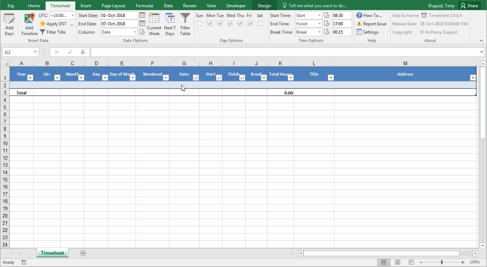
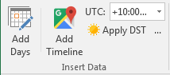
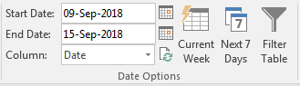
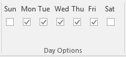
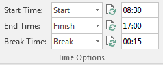
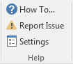
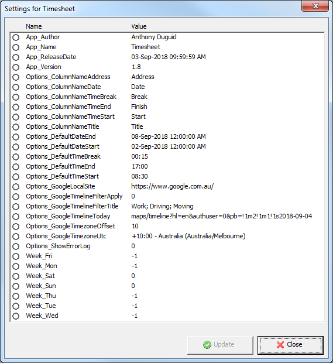
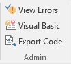
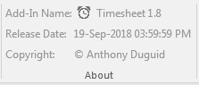

This Add-In is used to produce a timesheet file with functionality to import your [Google Timeline](https://www.google.com/maps/timeline). The standard timesheet has options for start and end dates, day of week and default start, end and break times. The Google timeline options are start and end dates, UTC selection, daylight savings time parameters and title filter for timeline entries. There is also a right click shortcut to open your Google timeline to the date of the row that is currently selected. I used [Terence Eden's blog post](https://shkspr.mobi/blog/2015/09/get-your-google-location-history-the-hard-way-again/) as a reference to write the procedure for downloading the Google Timeline files. Code review suggestions have been applied from this [article](https://codereview.stackexchange.com/q/206017/158032).

<!--[](https://www.paypal.me/AnthonyDuguid/1.00)-->
[](LICENSE "MIT License Copyright © Anthony Duguid")
[](https://github.com/Excel-projects/Excel-Timesheet/releases)
[](https://github.com/Excel-projects/Excel-Timesheet/commits/master)
[](https://github.com/Excel-projects/Excel-Timesheet/issues)
<!--[](https://github.com/Excel-projects/Excel-Timesheet/releases)-->

-----

<h1 align="left">
  
</h1>

<br>

## Table of Contents
- <a href="#install">Install</a>
- <a href="#dependencies">Dependencies</a>
- <a href="#glossary-of-terms">Glossary of Terms</a>
- <a href="#functionality">Functionality</a> 
    - <a href="#ribbon-group-insert-data">Insert Data</a>
    - <a href="#ribbon-group-date-options">Date Options</a>
    - <a href="#ribbon-group-day-options">Day Options</a>
    - <a href="#ribbon-group-time-options">Time Options</a>
    - <a href="#ribbon-group-help">Help</a>
    - <a href="#ribbon-group-admin">Admin</a>
    - <a href="#ribbon-group-about">About</a>

<br>

<a id="user-content-install" class="anchor" href="#install" aria-hidden="true"> </a>
## Install
Instructions for installation of VBA version

### VBA
How to install the VBA version
1. Download the VBA Add-In file [](https://github.com/Excel-projects/Excel-Timesheet/raw/master/VBA/Timesheet.xlsm?raw=true "Download the VBA Add-In").

<br>

<a id="user-content-dependencies" class="anchor" href="#dependencies" aria-hidden="true"> </a>
## Dependencies
|Software                                   |Dependency                 |Project                    |
|:------------------------------------------|:--------------------------|:--------------------------|
|[Microsoft Excel 2010 (or later)](https://www.microsoft.com/en-au/software-download/office)|Project|VBA|
|[Visual Basic for Applications](https://msdn.microsoft.com/en-us/vba/vba-language-reference)|Code|VBA|
|[Extensible Markup Language (XML)](https://www.rondebruin.nl/win/s2/win001.htm)|Ribbon|VBA, VSTO|
|[ScreenToGif](http://www.screentogif.com/)|Read Me|VBA, VSTO|
|[Snagit](http://discover.techsmith.com/snagit-non-brand-desktop/?gclid=CNzQiOTO09UCFVoFKgod9EIB3g)|Read Me|VBA, VSTO|
|Badges ([Library](https://shields.io/), [Custom](https://rozaxe.github.io/factory/), [Star/Fork](http://githubbadges.com))|Read Me|VBA, VSTO|

<br>

<a id="user-content-glossary-of-terms" class="anchor" href="#glossary-of-terms" aria-hidden="true"> </a>
## Glossary of Terms

| Term                      | Meaning                                                                                  |
|:--------------------------|:-----------------------------------------------------------------------------------------|
| COM |Component Object Model (COM) is a binary-interface standard for software components introduced by Microsoft in 1993. It is used to enable inter-process communication and dynamic object creation in a large range of programming languages. COM is the basis for several other Microsoft technologies and frameworks, including OLE, OLE Automation, ActiveX, COM+, DCOM, the Windows shell, DirectX, UMDF and Windows Runtime.  |
| VBA |Visual Basic for Applications (VBA) is an implementation of Microsoft's event-driven programming language Visual Basic 6 and uses the Visual Basic Runtime Library. However, VBA code normally can only run within a host application, rather than as a standalone program. VBA can, however, control one application from another using OLE Automation. VBA can use, but not create, ActiveX/COM DLLs, and later versions add support for class modules.|
| VSTO |Visual Studio Tools for Office (VSTO) is a set of development tools available in the form of a Visual Studio add-in (project templates) and a runtime that allows Microsoft Office 2003 and later versions of Office applications to host the .NET Framework Common Language Runtime (CLR) to expose their functionality via .NET.|
| XML|Extensible Markup Language (XML) is a markup language that defines a set of rules for encoding documents in a format that is both human-readable and machine-readable.The design goals of XML emphasize simplicity, generality, and usability across the Internet. It is a textual data format with strong support via Unicode for different human languages. Although the design of XML focuses on documents, the language is widely used for the representation of arbitrary data structures such as those used in web services.|
| KML|Keyhole Markup Language (KML) is an XML notation for expressing geographic annotation and visualization within Internet-based, two-dimensional maps and three-dimensional Earth browsers. KML was developed for use with Google Earth, which was originally named Keyhole Earth Viewer.|
<body>

<br>

<a id="user-content-functionality" class="anchor" href="#functionality" aria-hidden="true"> </a>
## Functionality
This Excel ribbon is inserted after the “Home” tab when Excel opens. Listed below is the detailed functionality of this application and its components.  


<a id="user-content-ribbon-group-insert-data" class="anchor" href="#ribbon-group-insert-data" aria-hidden="true"> </a>
### Insert Data (Group)
Insert rows of data into the active table with the following controls.

<h1 align="left">
  
</h1>

####	Add Days (Button)
* Add days from the textbox values in the start and end dates in the "Date Options" group.
* Optional filter for day of week in "Day Options" group.

####	Add Timeline (Button)
* Add timeline events filter from the start and end dates in the "Date Options" group.
* Downloads the .kml files per day from Google Timeline
* Imports each .kml file with optional filters for Title (using a delimited list in the settings) and day of week in "Day Options" group.

#### UTC (Dropdown)
* This is the timezone offset for the stored date & time values in your Google Timeline.
* Uses a hidden sheet for the list of Timezones

#### Apply DST (Toggle Button)
* This will apply the daylight savings time to the Google Timeline import.

#### Filter Title (Toggle Button)
* This will apply the title filter from the settings to the Google Timeline import.


<a id="user-content-ribbon-group-date-options" class="anchor" href="#ribbon-group-date-options" aria-hidden="true"> </a>
### Date Options (Group)
These date options will filter the selected table.

<h1 align="left">
  
</h1>

#### Start Date (Textbox)
* The value that is used to filter inserts.

#### End Date (Textbox)
* The value that is used to filter inserts.

#### Column (Combobox)
* This refers to the column name that date values get added to.

#### Calendar (Buttons)
* These buttons allow the user to select a date from a calendar.
* Note: The calendar has a reference to Common Controls

#### Refresh (Button)
* This button will refresh the list of column names in the combobox.

#### Current Week (Button)
* This button will set the start and end dates in the textboxes to the current week.

#### Next 7 Days (Button)
* This button will set the start and end dates in the textboxes to the next 7 days using the maximum date from the selected table.

#### Filter Table (Button)
* This button will filter the selected table with the start and end dates from the textboxes.


<a id="user-content-ribbon-group-day-options" class="anchor" href="#ribbon-group-day-options" aria-hidden="true"> </a>
### Day Options (Group)


<h1 align="left">
  
</h1>

#### Sun, Mon, Tue, Wed, Thu, Fri, Sat (Checkboxes)
* These checkboxes allow the user to limit the records inserted into the table by selected days


<a id="user-content-ribbon-group-time-options" class="anchor" href="#ribbon-group-time-options" aria-hidden="true"> </a>
### Time Options (Group)


<h1 align="left">
  
</h1>

#### Start Time  (Combobox)
* The column name of the start time

#### End Time (Combobox)
* The column name of the end time

#### Break Time (Combobox)
* The column name of the break time

#### Refresh (Buttons)
* Refreshes the list of column name from the selected table

#### Start Time  (Textbox)
* The default value for the start time when inserted into the selected table

#### End Time (Textbox)
* The default value for the end time when inserted into the selected table

#### Break Time (Textbox)
* The default value for the break time when inserted into the selected table


<a id="user-content-ribbon-group-help" class="anchor" href="#ribbon-group-help" aria-hidden="true"> </a>
###	Help (Group)


<h1 align="left">
  
</h1>


#### How To… (Button)
* Opens a webpage of the read me documentation

#### Report Issue (Button)
* Opens a page to create a new issue for the product

#### Settings (Button)
* Settings represent user preferences or valuable information the application needs to use.
* This opens the settings form. The settings are stored as custom properties and can be changed by double-clicking the item or using the update button.

<kbd>
VBA
<br>
  
</kbd>

- VBA Settings
  - To add a new setting
    ```vbnet
    ThisWorkbook.CustomDocumentProperties.Add _
    Name:="App_ReleaseDate" _
    , LinkToContent:=False _
    , Type:=msoPropertyTypeDate _
    , Value:="31-Jul-2017 1:05pm"
    ```
  - To update a setting
    ```vbnet
    ThisWorkbook.CustomDocumentProperties.Item("App_ReleaseDate").Value = "31-Jul-2017 1:05pm"
    ```
  - To delete a setting
    ```vbnet
    ThisWorkbook.CustomDocumentProperties.Item("App_ReleaseDate").Delete
    ```

<a id="user-content-ribbon-group-admin" class="anchor" href="#ribbon-group-admin" aria-hidden="true"> </a>
###	Admin (Group)
This group's visibility is toggled with the <kbd>F12</kbd> key

<h1 align="left">
  
</h1>


#### View Errors (Toggle Button)
* View a list of errors in a hidden sheet

#### Visual Basic (Button)
* Opens the Visual Basic editor

#### Export Code (Button)
* Export the VBA and XML code for this file to the current directory


<a id="user-content-ribbon-group-about" class="anchor" href="#ribbon-group-about" aria-hidden="true"> </a>
###	About (Group)

<h1 align="left">
  
</h1>


<a id="user-content-description" class="anchor" href="#description" aria-hidden="true"> </a>
#### Add-in Name (Label)
* The application name with the version

<a id="user-content-install-date" class="anchor" href="#install-date" aria-hidden="true"> </a>
#### Release Date (Label)
* The release date of the application

<a id="user-content-copyright" class="anchor" href="#copyright" aria-hidden="true"> </a>
#### Copyright (Label)
* The author’s name
